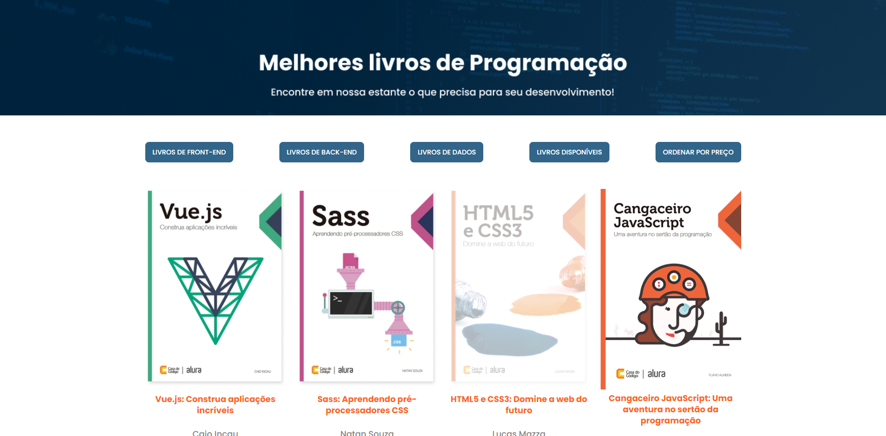

## Visão Geral

### O projeto

- Projeto de um site de livros com filtros de preço e categoria, utilizando uma API

### Screenshot

### Links

- Live Site URL: [AluraBooks JS](https://alurabooks-js-green.vercel.app/)

## Meu processo

### Criado com

- JavaScript
- HTML e CSS fornecidos pelo curso

### O que eu aprendi

- Aprendi a fazer uma requisição
- sort()
- forEach()
- filter()
- reduce()
- map()

## Autor

- GitHub - [João Metzdorf](https://github.com/joaometzdorf)
